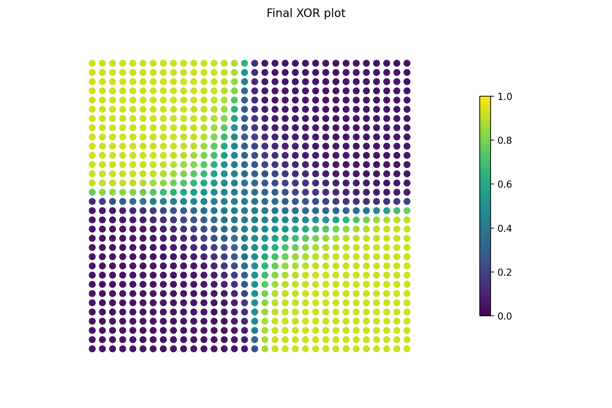

# Generic Neural Network Python Library

- only supports sigmoid activation
- n fully connected sequential layers (dense)
- MSE loss
- stochastic gradient descent

NOTE: the code for this library has been greately enhanced for a subsequent project [link here](https://github.com/amaynez/TicTacToe/blob/master/entities/Neural_Network.py)

This program creates a neural network programmatically with the following parameters:
- number of inputs
- number of neurons in hidden layer 1, ..., number of neurons in hidden layer n
- number of outputs
- learning rate

Once created the Neural Network has two functions:
- <b>Forward Propagation</b>: to generate a prediction or guess based on the inputs
- <b>Train</b>: to modify the inner weights and biases based on given inputs and target outputs

For testing purposes the XOR algorithm is implemented in the main.py script.

TO DO:
- multiple activation functions (ReLu, linear, Tanh, etc.)
- multiple optimizers (Adam, RMSProp, SGD Momentum, etc.)
- batch and epoch training schedules
- save and load trained model to file
